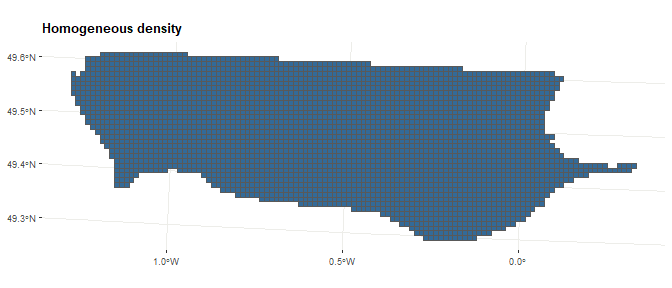
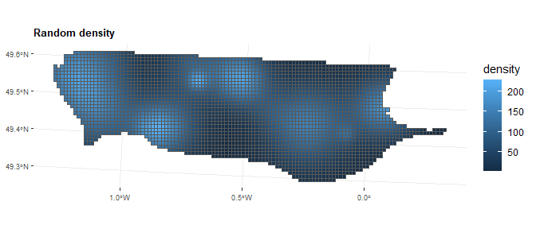
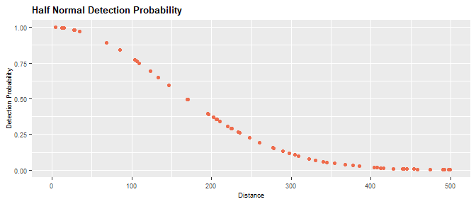
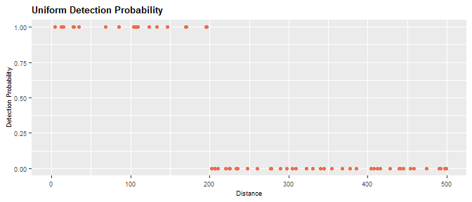

<!-- README.md is generated from README.Rmd. Please edit that file -->

# Simulated Survey Of Megafauna At Offshore Windfarms :airplane::dolphin:

<!-- badges: start -->

<!-- badges: end -->

<br/>

**sismow** was developed as part of the **OWFSOMM** project. The
objective of this project is to demonstrate the technical relevance of
aerial digital monitoring while ensuring their comparability with
observer-based visual monitoring.

The goal of `sismow` is to simulate different **datasets of aerial
monitoring**. To do this, `sismow` allows to simulate:

1.  density maps
2.  sampling transects
3.  observation probabilities

With the different functions of this package, it is possible to simulate
digital and visual aerial monitoring for different conditions (more or
less abundant species, more or less homogeneously distributed in space,
more or less discreet…). This allows then to calculate abundances and
distributions under different conditions and to calculate
intercalibration parameters between the two methods.

### Installation

-----

You can install the development version of `sismow` from
[GitHub](https://github.com/) with:

``` r
# install.packages("devtools")
#devtools::install_github("maudqueroue/sismow")
library(sismow)
#> Registered S3 method overwritten by 'spatstat.geom':
#>   method     from
#>   print.boxx cli
```

### Population Abundance Emulator

-----

#### Simulate density

First, the function `simulate_density` allows to create map with
different spatial variation of density.

##### Examples :

  - **homogeneous**: same density througout the studied area.

<!-- end list -->

``` r
map <- simulate_density(shape_obj = shape_courseulles,
                        density_type = "uniform")
```



  - **gradient** : density decreasing from a hotspot that could be
    placed on different directions (`gradient_direction` : Center,
    North, East…). The `amplitude` and `wavelength` of the hotspot
    created can be modulated by the user.

<!-- end list -->

``` r
map <- simulate_density(shape_obj = shape_courseulles,
                        density_type = "gradient",
                        gradient_direction = "NW",
                        amplitude = 200,
                        wavelength = 40000)
```


  - **Random**: random density. Several hotspots `nb_hotspots` are
    randomly created with amplitude and wavelength randomly chosen. The
    maximum value of `amplitude` and `wavelength` can be modulated by
    the user.

<!-- end list -->

``` r
map <- simulate_density(shape_obj = shape_courseulles,
                        density_type = "random",
                        amplitude = 200,
                        wavelength = 10000,
                        nb_hotspots = 15)
```



#### Simulate individuals

The `simulate_ind` function allows to simulate an approximate number of
individuals/groups with an inhomogenous Poisson point process according
to the densities provided in the `map` object.

##### Examples :

  - Simulation of `N` = 200 individuals with `mean_group_size` = 1:

<!-- end list -->

``` r
ind <- simulate_ind(map_obj = map, 
                    mean_group_size = 1, 
                    N = 200)
```


  - Simulation of `N` = 100 groups of `mean_group_size` 5 individuals

<!-- end list -->

``` r
ind <- simulate_ind(map_obj = map, 
                    mean_group_size = 5, 
                    N = 100)
```


### Sampling Design Emulator

-----

#### Simulate transects

The function `simulate_transects` allows to simulate transects with
different conditions:  
\- different types of **survey design** such as parallel, zigzag,
crossed zigzag or random transects  
\- **total transect length** (approximately)  
\- **angle** of the transects  
\- **segmentation** of the transects - **segments** length
(approximately)

##### Examples:

  - **parallel** transects design with an approximate total line length
    of **400km**:

<!-- end list -->

``` r
transects <- simulate_transects(shape_obj = shape_courseulles,
                             design = "systematic",
                             line_length = 400000)
```


  - **zigzag** transects design with an approximate total line length of
    **600km** that are segmentized with a \`length of approximatively
    **2000m** per segment.

<!-- end list -->

``` r
transects <- simulate_transects(shape_obj = shape_courseulles,
                             design = "eszigzag",
                             line_length = 600000,
                             design_angle = 90,
                             segmentize = TRUE,
                             seg_length = 2000)
```


### Observation Data Emulator

-----

#### Simulate observations

The function `simulate_obs` allows to simulate datasets of observations
according to:

1.  The **individuals/groups** simulated on the **density** map.  
2.  The **transect design** simulated.  
3.  A **detection probability**.

To determine the detection probability, the user can choose:  
\- The form of the detection function : **uniform** or **half-normal**  
\- The maximum distance of observation (**truncation**)  
\- The probability of observation at distance 0 (**g\_zero**)  
\- The effective strip width (**esw**) for half-normal detection
function

##### Examples:

  - **Half normal** detection probability equal to **1** at 0 distance
    with a effective strip half width of **180m**.

<!-- end list -->

``` r
obs <- simulate_obs(ind_obj = ind,
                    transect_obj = transects,
                    key = "hn",
                    g_zero = 1,
                    esw = 180)
```


- **Uniform** detection probability equal to **1** below distance
**200m** .

``` r
obs <- simulate_obs(ind_obj = ind,
                    transect_obj = transects,
                    key = "unif",
                    g_zero = 1,
                    truncation = 200)
```


