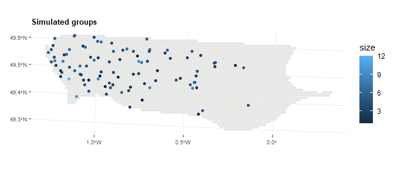
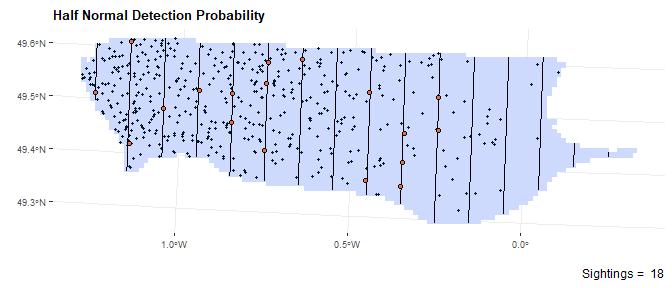

<!-- README.md is generated from README.Rmd. Please edit that file -->

# Simulated Survey Of Megafauna At Offshore Windfarms :airplane::dolphin:

<!-- badges: start -->

<!-- badges: end -->

**sismow** was developed as part of the OWFSOMM project. The objective
of this project is to demonstrate the technical relevance of aerial
digital monitoring while ensuring their comparability with
observer-based visual monitoring.

The goal of `sismow` is to simulate different **datasets of aerial
monitoring**. To do this, `sismow` allows to simulate :

1.  different density map
2.  different sampling transect
3.  different observation probability

With the different functions of this package, it is possible to simulate
digital and visual aerial monitoring for different conditions (more or
less abundant species, more or less homogeneously distributed in space,
more or less discreet…). This allows then to calculate abundances and
distributions from the different datasets under different conditions and
to calculate the intercalibration parameters between the two methods.

## Installation

-----

You can install the development version of `sismow` from
[GitHub](https://github.com/) with:

``` r
# install.packages("devtools")
# devtools::install_github("maudqueroue/sismow")
library(sismow)
```

## \#\# Population Abondance Emulator

### Simulate density

First, the function `simulate_density` allows to create map with
different density types.

##### Examples :

  - **homogeneous**: same density througout the studied area.

<!-- end list -->

``` r
map <- simulate_density(shape_obj = shape_courseulles,
                        density_type = "uniform")
```


  - **gradient** : density decreasing from a hotspot that could be
    placed on different direction.

<!-- end list -->

``` r
map <- simulate_density(shape_obj = shape_courseulles,
                        density_type = "gradient",
                        gradient_direction = "NW",
                        amplitude = 200,
                        wavelength = 40000)
```


  - **Random**: random density.

<!-- end list -->

``` r
map <- simulate_density(shape_obj = shape_courseulles,
                        density_type = "random",
                        amplitude = 200,
                        wavelength = 10000,
                        nb_hotspots = 15)
```


### Simulate individuals

The `simulate_ind` function allows to simulate a approximate number of
individuals/groups with a inhomogenous Poisson point process according
to the densities provided.

##### Examples :

  - Simulation of individuals :

<!-- end list -->

``` r
ind <- simulate_ind(map_obj = map, 
                    mean_group_size = 1, 
                    N = 200)
```


  - Simulation of groups of 5 individuals

<!-- end list -->

``` r
ind <- simulate_ind(map_obj = map, 
                    mean_group_size = 5, 
                    N = 100)
```



## Sampling Design Emulator

### Simulate transects

The function `simulate_transects` allows to simulate transects with
different conditions :  
\- different types of **survey design** such as parallel, zigzag,
crossed zigzag or random transects  
\- **total transect length** (approximately)  
\- **angle** of the transects  
\- **segmentation** of the transects - **segments** length
(approximately)

##### Examples:

  - **parallel** transects with a approximative total length of **400
    km**:

<!-- end list -->

``` r
transects <- simulate_transects(shape_obj = shape_courseulles,
                             design = "systematic",
                             line.length = 400000)
```


  - **zigzag** transects with a approximative length of **600 km** that
    are segmentized with a length of approximatively **2000m** per
    segment.

<!-- end list -->

``` r
transects <- simulate_transects(shape_obj = shape_courseulles,
                             design = "eszigzag",
                             line.length = 600000,
                             design.angle = 90,
                             segmentize = TRUE,
                             length_segs = 2000)
```


## Observation Data Emulator

### Simulate observation

The function `simulate_obs` allows to simulate dataset of observations
according to:  
1\. The **individuals/groups simulated** on the **density** map.  
2\. The **transect design** simulated.  
3\. A **detection probability**.

To determine the detection probability it is possible to choose:  
\- The form of the detection function : **uniform** or **half-normal**  
\- The maximum distance of observation (**truncation**)  
\- The probability of observation at distance 0 (**g\_zero**)  
\- The effective strip width (**esw**) for half-normal detection
function

##### Examples:

  - **Half normal** detection probability equal to **1** at 0 distance
    with a effective half width of **180m**.

<!-- end list -->

``` r
obs <- simulate_obs(ind_obj = ind,
                    transect_obj = transects,
                    key = "hn",
                    g_zero = 1,
                    esw = 180)
```


- **Uniform** detection probability equal to **1** below distance
**200m** .

``` r
obs <- simulate_obs(ind_obj = ind,
                    transect_obj = transects,
                    key = "unif",
                    g_zero = 1,
                    truncation = 200)
```


